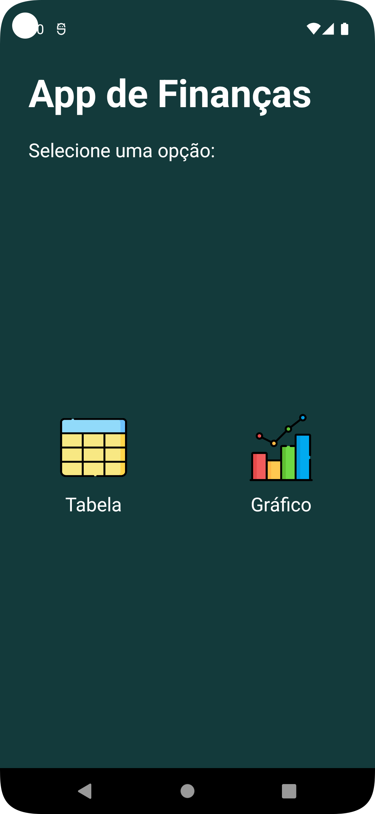
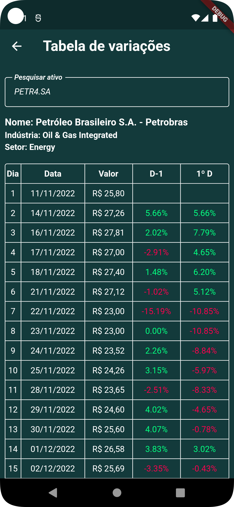
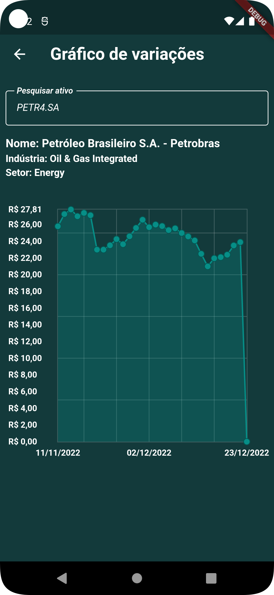

# Finances App
Esse é um app desenvolvido em flutter/dart que exibe as variações de ativos financeiros na forma de tabela e gráfico

## Principais bibliotecas/tecnologias utilizadas
- Gerenciamento de estado: [Bloc](https://pub.dev/packages/bloc), [Flutter_bloc](https://pub.dev/packages/flutter_bloc)
- Injeção de dependências: [GetIt](https://pub.dev/packages/get_it)
- Requisições http: [Dio](https://pub.dev/packages/dio)
- Gráficos: [FL Chart](https://pub.dev/packages/fl_chart)
- Testes: [Mocktail](https://pub.dev/packages/mocktail), [bloc_test](https://pub.dev/packages/bloc_test)

## Arquitetura
- A arquitetura utilizada no app foi baseada na
[Clean Dart](https://github.com/Flutterando/Clean-Dart)
(Proposta de Arquitetura Limpa da Flutterando)
- O app possui uma tela em Android/Java (tela de menu) e as demais são em Flutter/Dart

## API
A API utilizada nesse app foi: [Yahoo Finance](https://finance.yahoo.com/)

## Testes
Foram implementados testes de unidades e widgets

## Build/Tests
Passo 1: [Instale o Flutter](https://docs.flutter.dev/get-started/install)
(Versão utilizada no desenvolvimento: 3.3.9)

Passo 2: Baixe ou clone este repositório usando o link abaixo:
```
https://github.com/GerlanStanley/finances_app.git
```

Passo 3: Vá para a raiz do projeto e execute o seguinte comando no console para obter as dependências necessárias:
```
flutter pub get
```

Passo 4: Para executar o projeto realize o comando
```
flutter run
```

Passo 5: Para executar os testes realize o comando
```
flutter test
```

## Screenshots
<p float="left">
    
     
     
</p>